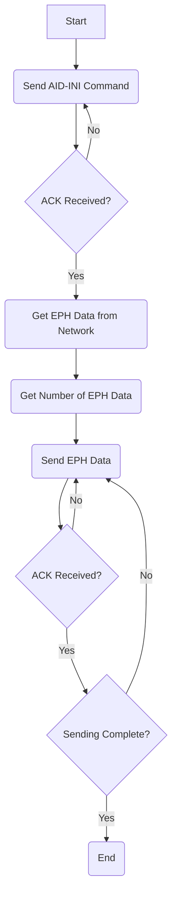

# Quectel L76K AGNSS Application Guide

## 1. Introduction
This document describes the operation process and related commands for the Quectel L76K module's AGNSS function[cite: 18]. The AGNSS function is primarily used to shorten the Time to First Fix (TTFF) of the L76K module[cite: 18, 36]. To use this function, satellite data (EPH) must be downloaded from a relevant server and injected into the module via a serial port[cite: 18].

## 2. AGNSS Operation Process
This section details the AGNSS satellite data download, satellite data format, and AGNSS test procedures[cite: 19].

### 2.1. Satellite Data Download
Users can download satellite data files, named `eph.dat`, via FTP from `ftp://agnss.queclocator.com`[cite: 19].

**Note:**
1. Quectel's server provides real-time satellite data. Users need to set up their own server to download and store this data from Quectel's server, with updates recommended every hour to facilitate satellite data injection into terminal devices[cite: 19].
2. Contact Quectel technical support to obtain an account for accessing Quectel's server[cite: 19].

### 2.2. Satellite Data Format
Satellite data consists of multiple CASIC commands[cite: 19]. Refer to Chapter 3 for details on CASIC commands related to satellite data[cite: 19]. The satellite data format is illustrated below[cite: 19]:

### 2.3. AGNSS Test Procedure
After the terminal device's main controller obtains satellite data, it needs to interact with the module via a serial port to complete the satellite data injection[cite: 22]. The data transfer process is as follows; refer to Chapter 3 for detailed command information[cite: 22]:

1. The terminal device's main controller sends AID-INI to the module[cite: 22].
2. Upon receiving the command, the module sends an ACK to the main controller. If reception fails, the module sends a NACK to the main controller[cite: 22].
3. After receiving the ACK, the terminal device's main controller sends satellite data to the module (the data sending process is defined and implemented by the user)[cite: 22]. Since the satellite data is in CASIC command format, it is recommended to follow the command sending process when transmitting satellite data[cite: 22].
4. Upon receiving the satellite data, the module stores it in RAM and sends an ACK to the main controller[cite: 22]. If data reception fails, the module sends a NACK, and the main controller needs to re-send the satellite data packet[cite: 22].

The sending process is illustrated in the flow chart below[cite: 22]:


**Figure 2: Sending Process** [cite: 22]

**Example:**
* **Blue**: Data transmission [cite: 23]
* **Red**: ACK message [cite: 23]
* **Black**: NMEA data [cite: 23]

```
$GPTXT,01,01,02$MA=CASIC*27
$GPTXT,01,01,02,IC=AT6558-5N-32-1C510800*48
$GPTXT,01,01,02, SW=URANUS5,$.1.0.0*1F
$GPTXT,01,01,02,TB=2018-04-18, 10:28:16*40
$GPTXT,01,01,02$JMO=GB*77
$GNGGA,,,,,,0,00,25.5,,,,,,*64
$GNGLL,...,,V,N*7A
$BDGSV,3,1,10,02,37,229,36,03,51,192,37,04,31,119,37,05,17,251,33,0*7A
$BDGSV,3,2,10,06,39,190,38,07,68,352,41,09,56,221,39,10,56,301,38,0*79
//AID-INI Command send:
BA CE 38 00 OB 01 52 B8 1E 85 EB D1 3F 40 D7 A3 70 3D 0A 47 5D 40 00 00 00 00 00 00 00 00 00 00
00 00 7C 2E 11 41 00 00 00 00 00 00 00 00 00 00 00 3F 00 00 00 00 E5 07 00 00 62 08 00 23 19 B4 48
E7
$GNRMC,063040.000,A,3419.32306, N, 11706.92160,E,0.00,0.00,030321,,,A,V*0E
$GNVTG,0.00,T,,M,0.00,N,0.00,Κ,Α*23
//AID-INI ACK:
BA CE 04 00 05 01 OB 01 00 00 OF 01 05 01
$GNGGA,063041.000,3149.32307,N,11706.91259,E, 1,19,0.8,56.8,M,-5.0,M,,*6C
$GNGLL,3149.32307,N,11706.91259,E,063041.000,A,A*4A
//Ephemeris data send:
BA CE 48 00 08 07
CD CD 9A 10 E5 7D 0D A1 A0 03 59 05 58 30 63 21 98 4B 91 03 DA 64 0F 28 EC 77
2E B1 4C A8 FF FF EC 2C 81 05 12 05 85 14 DB 19 9C 05 OC 00 40 00 FA 32 63 00 FA 32 00 00 8E 96
18 00 B7 FF 00 0A 27 00 00 00 01 03 A3 41 E2 9B 3D 28 BA CE 48 00 07 F3 E1 31 8C 1E FC 0C A1 8D
A9 6D 0A 3B F5 4C C1 28 F5 A4
OD 0A 5C 32 27 C1 AD D6 AD AB A3 FF FF E0 31 8F 04 DA 05 7F 15
26 17 08 07 57 FF B1 FF FA 32 63 00 FA 32 00 00 39 ED EC FF DF FF 00 DA 2A 00 00 00 02 03 A3 41
2E C4 6B 1F
$GNVTG,0.00, T,,M,0.00,N,0.00,Κ,Α*23
//Ephemeris data ACK:
BA CE 04 00 05 01 08 07 00 00 00 07 05 01
BA CE 04 00 05 01 08 07 00 00 OC 07 05 01
```

## 3. AGNSS Related Commands
For relevant data formats, please refer to the CASIC format in document [2][cite: 26].

### 3.1. Data Format
The data types used are[cite: 27]:

| Abbreviation | Type          | Length (bytes) | Notes     |
|:-------------|:--------------|:---------------|:----------|
| U1           | Unsigned char | 1              |           |
| I1           | Signed char   | 1              | Two's complement |
| U2           | Unsigned short | 2              |           |
| I2           | Signed short  | 2              | Two's complement |
| U4           | Unsigned long | 4              |           |
| I4           | Signed long   | 4              | Two's complement |
| R4           | IEEE754 Single precision | 4              |           |
| R8           | IEEE754 Double precision | 8              |           |

### 3.2. AID-INI
This command is used to send auxiliary position, clock, and other information[cite: 27]. It is sent by the terminal device's main controller, and the module will return an ACK upon receiving it[cite: 27].

**Format:**

| Header | Length (bytes) | Identifier | Payload | Checksum |
|:-------|:---------------|:-----------|:--------|:---------|
| 0xBA 0xCE | 56             | 0x0B 0x01  | See table below | 4 bytes  | [cite: 27]

**Payload:**

| Character Offset | Data Type | Scale Factor | Name       | Unit    | Description                               |
|:-----------------|:----------|:-------------|:-----------|:--------|:------------------------------------------|
| 0                | R8        | -            | Lat        | Degrees | Latitude                                  |
| 8                | R8        | -            | Lon        | Degrees | Longitude                                 |
| 16               | R8        | -            | Alt        | Meters  | Altitude. Usually 0                       |
| 24               | R8        | -            | TOW        | Seconds | GPS Time of Week                          |
| 32               | R4        | 300          | FreqBias   | ppm     | Clock frequency offset. Usually 0         |
| 36               | R4        | -            | pAcc       | m^2     | Variance of estimated position error. Usually 0 |
| 40               | R4        | C^2          | tAcc       | S^2     | Variance of estimated time error. Usually 0 |
| 44               | R4        | 300^2        | fAcc       | ppm^2   | Variance of time frequency drift error    |
| 48               | U4        | -            | Res        | -       | Reserved                                  |
| 52               | U2        | -            | WN         | -       | GPS Week Number                           |
| 54               | U1        | -            | TimerSource | -       | Time source                               |
| 55               | U1        | -            | Flags      | -       | Flag mask. See Table 1 for details.       | [cite: 28]

**Table 1: Flag Mask** [cite: 28]

| Bit | Description                   |
|:----|:------------------------------|
| B0  | 1 = Position valid            |
| B1  | 1 = Time valid                |
| B2  | 1 = Clock frequency drift data valid |
| B3  | Reserved                      |
| B4  | 1 = Clock frequency data valid |
| B5  | 1 = Position is LLA format    |
| B6  | 1 = Altitude invalid          |
| B7  | Reserved                      | [cite: 29]

**Example:**
* **Send:** `BA CE 38 00 0B 01 00 00 00 80 EB D1 3F 40 00 00 00 40 0A 47 5D 40 00 00 00 00 00 00 00 00 00 00 00 00 A0 A1 15 41 00 00 00 00 00 00 00 00 00 00 00 3F 00 00 00 00 E5 07 00 00 62 08 00 23 14 CB BD` [cite: 30]
* **ACK:** `BA CE 04 00 05 01 0B 01 00 00 0F 01 05 01` [cite: 30]

### 3.3. MSG_BDSUTC
BDS fixed-point UTC data (parameters synchronized with UTC time)[cite: 30].

**Format:**

| Header | Length (bytes) | Identifier | Payload | Checksum |
|:-------|:---------------|:-----------|:--------|:---------|
| 0xBA 0xCE | 20             | 0x08 0x00  | -       | 4 bytes  | [cite: 31]

### 3.4. MSG_BDSION
BDS Ionospheric data[cite: 31].

**Format:**

| Header | Length (bytes) | Identifier | Payload | Checksum |
|:-------|:---------------|:-----------|:--------|:---------|
| 0xBA 0xCE | 16             | 0x08 0x01  | -       | 4 bytes  | [cite: 32]

### 3.5. MSG_BDSEPH
BDS Ephemeris[cite: 31].

**Format:**

| Header | Length (bytes) | Identifier | Payload | Checksum |
|:-------|:---------------|:-----------|:--------|:---------|
| 0xBA 0xCE | 92             | 0x08 0x02  | -       | 4 bytes  | [cite: 32]

### 3.6. MSG_GPSUTC
GPS fixed-point UTC data (parameters synchronized with UTC time)[cite: 33].

**Format:**

| Header | Length (bytes) | Identifier | Payload | Checksum |
|:-------|:---------------|:-----------|:--------|:---------|
| 0xBA 0xCE | 20             | 0x08 0x05  | -       | 4 bytes  | [cite: 34]

### 3.7. MSG_GPSION
GPS Ionospheric parameters[cite: 33].

**Format:**

| Header | Length (bytes) | Identifier | Payload | Checksum |
|:-------|:---------------|:-----------|:--------|:---------|
| 0xBA 0xCE | 16             | 0x08 0x06  | -       | 4 bytes  | [cite: 34]

### 3.8. MSG_GPSEPH
GPS Ephemeris[cite: 33].

**Format:**

| Header | Length (bytes) | Identifier | Payload | Checksum |
|:-------|:---------------|:-----------|:--------|:---------|
| 0xBA 0xCE | 72             | 0x08 0x07  | -       | 4 bytes  | [cite: 34]

### 3.9. ACK
This response message is used to acknowledge correctly received information[cite: 34]. If the AID-INI or satellite data sent by the terminal device's main controller is successfully received, the L76K module will send an ACK message to inform the main controller of successful reception[cite: 34].

**Format:**

| Header | Length (bytes) | Identifier | Payload | Checksum |
|:-------|:---------------|:-----------|:--------|:---------|
| 0xBA 0xCE | 4              | 0x05 0x01  | See table below | 4 bytes  | [cite: 35]

**Payload:**

| Character Offset | Data Type | Scale Factor | Name  | Unit | Description                  |
|:-----------------|:----------|:-------------|:------|:-----|:-----------------------------|
| 0                | U1        | -            | ClsID | -    | Type of correctly received message |
| 1                | U1        | -            | MsgID | -    | Number of correctly received message |
| 2                | U2        | -            | Res   | -    | Reserved                     | [cite: 35]

### 3.10. NACK
This response message is used to indicate incorrectly received information[cite: 35]. If the AID-INI or satellite data sent by the terminal device's main controller is not correctly received, the L76K module will send a NACK message to inform the main controller of the reception failure[cite: 35].

**Format:**

| Header | Length (bytes) | Identifier | Payload | Checksum |
|:-------|:---------------|:-----------|:--------|:---------|
| 0xBA 0xCE | 4              | 0x05 0x00  | See table below | 4 bytes  | [cite: 35]

**Payload:**

| Character Offset | Data Type | Scale Factor | Name  | Unit | Description                     |
|:-----------------|:----------|:-------------|:------|:-----|:--------------------------------|
| 0                | U1        | -            | ClsID | -    | Type of incorrectly received message |
| 1                | U1        | -            | MsgID | -    | Number of incorrectly received message |
| 2                | U2        | -            | Res   | -    | Reserved                        | [cite: 35]

## 4. Appendix: Reference Documents and Terminology Abbreviations

**Table 2: Reference Documents** [cite: 36]

| No. | Document Name                       | Description                |
|:----|:------------------------------------|:---------------------------|
| [1] | Quectel_L76K_Hardware Design Manual | L76K Hardware Design Manual |
| [2] | Quectel_L76K&L26K_GNSS_Protocol Specification | L76K, L26K GNSS Protocol Specification |
| [3] | Quectel_L76K_Reference Design Manual | L76K Reference Design Manual |

**Table 3: Terminology Abbreviations** [cite: 36]

| Abbreviation | English Explanation         | Chinese Explanation      |
|:-------------|:----------------------------|:-------------------------|
| ACK          | Acknowledge Character       | 确认消息                 |
| AGNSS        | Assisted GNSS               | 辅助式全球卫星导航系统   |
| BDS          | BeiDou Navigation Satellite System | 北斗卫星导航系统         |
| EPH          | Ephemeris                   | 星历                     |
| FTP          | File Transfer Protocol      | 文件传输协议             |
| GNSS         | Global Navigation Satellite System | 全球导航卫星系统         |
| GPS          | Global Positioning System   | 全球定位系统             |
| LLA          | Longitude, Latitude, Altitude | 经度、纬度、高度         |
| NACK         | Negative Acknowledgement    | 否定消息                 |
| RAM          | Random Access Memory        | 随机存储器               |
| TTFF         | Time to First Fix           | 首次定位时间             |
| UTC          | Coordinated Universal Time  | 协调世界时               |
